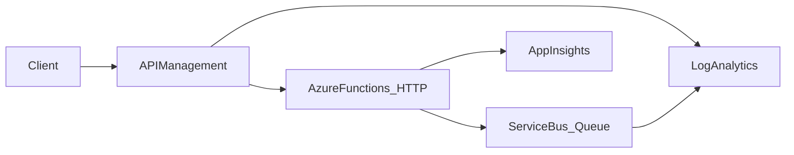
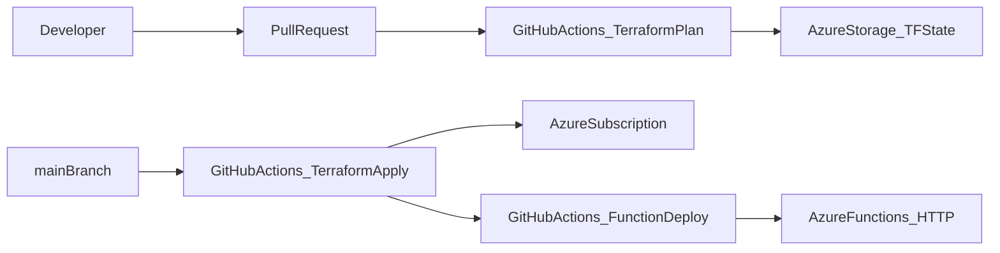

# Architecture

## Request / data flow

## CI/CD flow

## Components
- **API Management**: front door, routing, policies (rate limit, headers, optional JWT validation).
- **Azure Functions**: HTTP-triggered function; uses managed identity to access Service Bus and (optionally) Key Vault.
- **Service Bus**: queue for asynchronous messaging.
- **Observability**: Application Insights + Log Analytics; diagnostic settings enabled for platform resources.

## Hybrid considerations
This template is cloud-native but includes notes for hybrid extensions (private endpoints, private DNS, on-prem connectivity via VPN/ExpressRoute, and controlled egress patterns). See `docs/security.md` and `docs/troubleshooting.md`.

